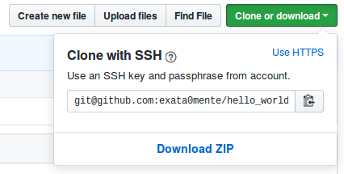

# Exata0mente

## Somos um site colaborativo!

Sim, este site é colaborativo. Nossa idéia é criar um ambiente onde todos possam aprender na prática, contribuir com temas, criar postagens, divulgar idéias ou até registrar notas de aulas.

Você pode fazer uma centena de coisas, vou listar algumas:

* Praticar HTML, CSS, FrontMatter, Liquid Template, entre outros.
* Praticar Git, GitHub, conceitos de trabalho colaborativos.
* Criar conteúdos, divulgar seu canal.
* [Resoluções de exercícios](https://github.com/exata0mente/ResolucoesLivros)
* Resoluções de Problemas ([issues](https://github.com/exata0mente/exata0mente.github.io/issues), por exemplo).
* Conhecer pessoas dispostas a trabalharem colaborativamente.
* [Divulgar](https://exata0mente.com.br/projetos/) seus projetos.
* [Conhecer](https://exata0mente.com.br/projetos/) projetos para colaborar.
* Divulgar pesquisas (tipo *form*) para trabalhos de conclusão de curso.

Dá uma olhada lá no site, tem muita coisa que pode ser feita:

https://exata0mente.com.br/

Este site é estático e foi gerado utilizando [Jekyll](https://jekyllrb.com/), que deixa muito fácil a criação de sites estáticos. O tema utilizado foi o [minimal](https://pages-themes.github.io/minimal/), que era a opção mais rápida a ser utilizada.

## Criando um parquinho

Para que este site possa ser executado localmente, facilitando a visualização das alterações, é necessário ter instalado algumas soluções. Como utilizamos o Jekyll, será necessário então:

* Jekyll
* Ruby

A [documentação](https://jekyllrb.com/) do Jekyll é suficiente para que você consiga instalar estas dependências.

Qualquer problema é só abrir uma issue.

## Brincando no parquinho

Bom, com o ambiente preparado localmente, será necessário trazer o repositório para sua máquina. Temos uma postagem sobre [como trabalhar colaborativamente utilizando o GitHub](https://exata0mente.com.br/resp/como-trabalhar-colaborativamente-utilizando-o-github) caso queira um pouco mais de contexto.

Vamos ao necessário então:

Dê um fork em nosso repositório:


Depois clone-o:



Dentro da pasta, verifique se todas as dependências estão instaladas com o comando abaixo

```bash
bundle
```

E em seguida suba o servidor localmente

```bash
bundle exec jekyll serve
```
Agora todas as alterações que você fizer poderão ser verificadas no endereço localhost:4000
